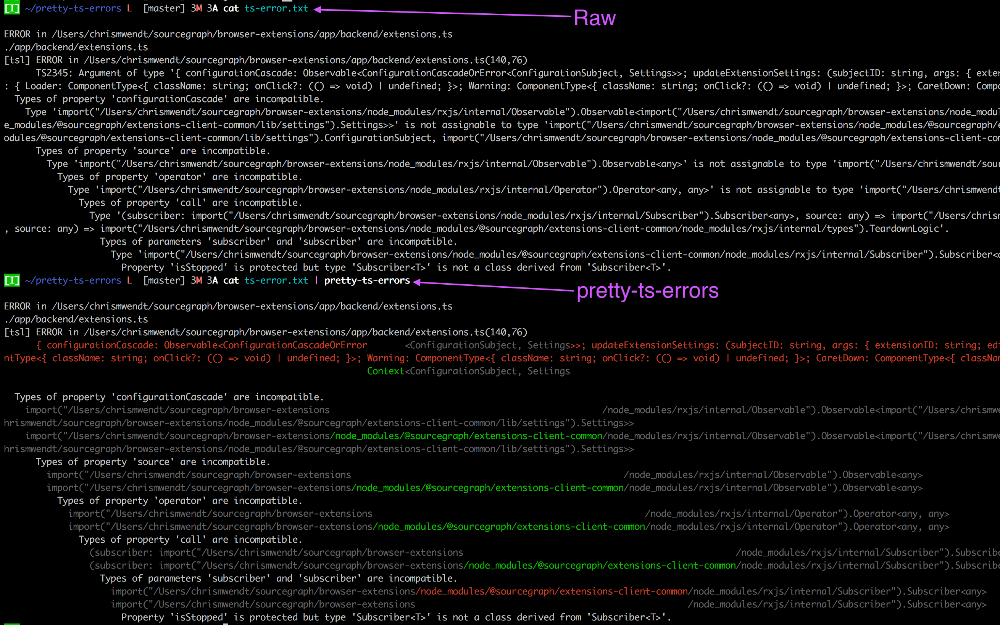

# pretty-ts-errors

Shows TypeScript errors as colorized diffs:



# Installation

Get [Stack for Haskell](https://docs.haskellstack.org/en/stable/README/):

```
curl -sSL https://get.haskellstack.org/ | sh
```

Clone this repository

```
git clone https://github.com/chrismwendt/pretty-ts-errors
```

Build and install:

```
stack install
```

# Usage

```
tsc | pretty-ts-errors
npm run dev | pretty-ts-errors
```